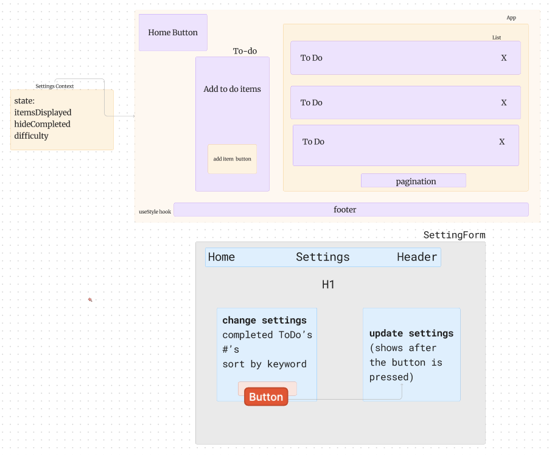

# LAB - Class 31

## Project: Context API

### Author: Kenya Womack

### Problem Domain

To Do List Manager Phase 1: Incorporate configuration settings to the application.

Currently, a user can add todo tasks to the proof-of-life starter application. In this phase, we will add hard-wired, default context settings to the application so that the user can view three incomplete todo tasks. In addition, the user will have the option of viewing any additional incomplete tasks by using pagination functionality

### Links and Resources

- [GitHub Actions ci/cd](https://github.com/KenyaWomack/todoapp/actions)
- [front-end application](https://codesandbox.io/p/github/KenyaWomack/todoapp/main?workspaceId=74e570a2-0464-4872-a1b6-feb4865179af)

### Collaborators

Reece 
Ike
Coriana Williams

## Lab Class 32

### Problem Domain

In Phase 2, we’re going to extend the functionality of our application by allowing the user to make some decisions on how they would like the application to function. Specifically, we’ll let them make changes to 2 settings.

Implement the Context API to make some basic application settings available to components.
How many To Do Items to show at once.
Whether or not to show completed items.
Hint: if reusing the custom useForm() hook, event validation may be necessary if using any Mantine component other than <TextInput />.
Provide the users with a form where they can change the values for those settings.
This should be given in the form of a new component, perhaps linked to from the main navigation.
Hint: Use Browser Router to create the page/route/component for this.
Once settings are updated, render the updated settings to the right of the “form”. Consider using <Grid />, <Card />, and <When /> components.
Save the users choices in Local Storage.
Retrieve their preferences from Local Storage and apply them to the application on startup.

## Collaborators

Coriana Williams

## Lab Class 33

## Problem Domain

In Phase 3, we’d like to extend the functionality of the application by requiring users be logged in to view items and also restrict access based on user type. The user stories from Phases 1, and 2 remain unchanged. For this phase, we are now adding the following new user stories.

As a user, I want to provide a way for other users to create new accounts.
As a user, I want to provide a way for all users to login to their account.
As a user, I want to make sure that my To Do items are only viewable to users that have logged in with a valid account.
As a user, I want to ensure that only fellow users that are allowed to “create”, based on their user type, can add new To Do Items.
As a user, I want to ensure that only fellow users that are allowed to “update”, based on their user type, can mark To Do Items complete.
As a user, I want to ensure that only fellow users that are allowed to “delete”, based on their user type, can delete new To Do Items.

## Collaborator

Coriana Williams

